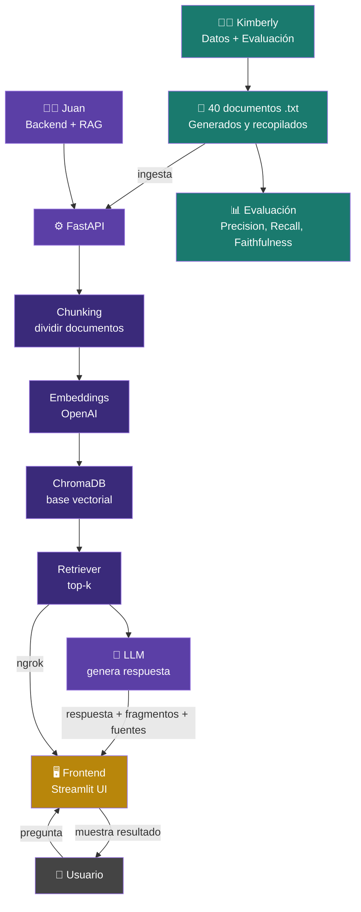

# 🏗️ Diagrama de Arquitectura — Asistente Académico RAG

## Diagrama

---

## Descripción de componentes

### 🟢 Kimberly — Datos + Evaluación
Encargada de recopilar y preparar los **40 documentos .txt** que alimentan el sistema. Los documentos fueron generados con apoyo de IA y recopilados de fuentes del curso. También es responsable de medir la calidad del sistema con métricas de **Precision@k**, **Recall@k** y **Faithfulness**.

### 🟣 Juan — Backend + RAG
Construyó el cerebro del sistema usando **FastAPI**. El pipeline funciona así:
- **Chunking**: divide los documentos en fragmentos manejables
- **Embeddings (OpenAI)**: convierte cada fragmento en un vector numérico
- **ChromaDB**: almacena los vectores para búsqueda rápida
- **Retriever (top-k)**: busca los fragmentos más relevantes para cada pregunta
- **LLM**: genera una respuesta basada únicamente en los fragmentos recuperados

### 🟡 Pablo — Interfaz de usuario
Construyó la interfaz con **Streamlit**. El usuario escribe una pregunta y el sistema muestra:
- La respuesta generada por el LLM
- Los fragmentos de texto utilizados
- Las fuentes de donde proviene la información
- Un mensaje de "no tengo evidencia" si no hay información suficiente

La comunicación entre el frontend y el backend se hace a través de **ngrok**, que expone el servidor de Juan a internet de forma segura.
